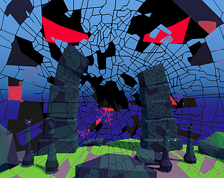
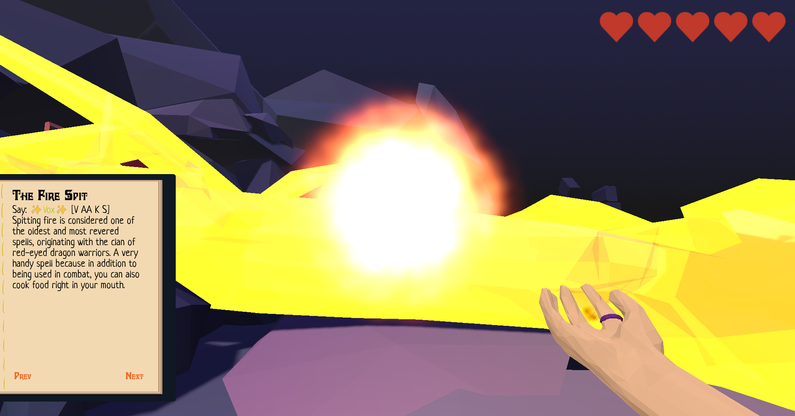

# HoP: Hop over Planes

## Description:
Exploring the dungeon, solving problems with magic and moving between the real and cognitive worlds. Spells must be spoken into a microphone.  
  
**You need to find 4 crystals to repair and open the Portal.**
  
## Controls:  
**WASD** - Movement  
**Q/E** - Rotation  
**Left Mouse** - Interact  
**Right Mouse** - Cast Spell  
**Space** - Hop to another plane  
**C** - Hold to Record Spell  
**Tab** - Open book  

`You can only cast spells in Cognitive plane. Items (like buttons) can only be interacted with only in Material plane.` 

  

## Resources
* **Music**:  
	King Gizzard and The Lizard Wizard - Searching...
* **Assets:**
	 [https://opengameart.org/content/different-steps-on-wood-stone-leaves-gravel-and-mud  
https://opengameart.org/content/items-door-fire-weapon-hits https://opengameart.org/content/3-item-sounds  
https://opengameart.org/content/spell-sounds-starter-pack  
https://kenney.nl/assets/rpg-audio](https://opengameart.org/content/different-steps-on-wood-stone-leaves-gravel-and-mudhttps://opengameart.org/content/items-door-fire-weapon-hitshttps://opengameart.org/content/3-item-soundshttps://opengameart.org/content/spell-sounds-starter-packhttps://kenney.nl/assets/rpg-audio)

## Credits
* [Breadp4ck](https://github.com/Breadp4ck)
* [TheActualTwinkle](https://github.com/TheActualTwinkle)
* [Tombleron](https://github.com/Tombleron)

